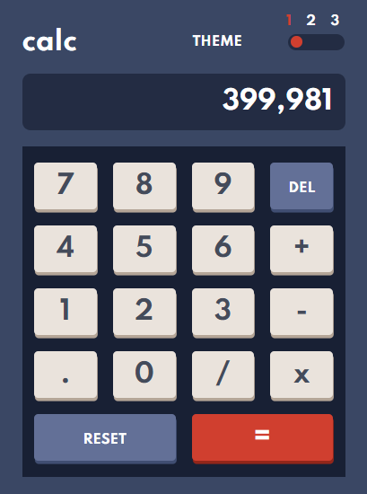

# Frontend Mentor - Calculator app solution

This is a solution to the [Calculator app challenge on Frontend Mentor](https://www.frontendmentor.io/challenges/calculator-app-9lteq5N29). Frontend Mentor challenges help you improve your coding skills by building realistic projects. 

## Table of contents

- [Overview](#overview)
  - [The challenge](#the-challenge)
  - [Screenshot](#screenshot)
  - [Links](#links)
- [My process](#my-process)
  - [Built with](#built-with)
  - [What I learned](#what-i-learned)
  - [Continued development](#continued-development)
  - [Useful resources](#useful-resources)
- [Author](#author)
- [Acknowledgments](#acknowledgments)


## Overview

### The challenge

Users should be able to:

- See the size of the elements adjust based on their device's screen size
- Perform mathmatical operations like addition, subtraction, multiplication, and division
- Adjust the color theme based on their preference
- **Bonus**: Have their initial theme preference checked using `prefers-color-scheme` and have any additional changes saved in the browser

### Screenshot



### Links

- Solution URL: [Solution on Github](https://github.com/Lateefat/calculator-app-project)
- Live Site URL: [Add live site URL here](https://calculator-app-lateefat.netlify.app/)

## My process

### Built with

- Semantic HTML5 markup
- CSS custom properties
- CSS Grid
- Vanilla JavaScript

### What I learned

One major thing I discovered is the eval() JS function. It was easy to use. However, it is a risky function to use as it can be used to introduce malicious code into the browser. There's even a warning on [it's documentation:](https://developer.mozilla.org/en-US/docs/Web/JavaScript/Reference/Global_Objects/eval).

What a did which I hope is a safety measure is making the input box readable only. Here's the snippet:

```html
        <input type="text" class="screen theme1Input" id="screen" maxlength="20" readonly>

<!-- P.S. the maxlength property did not work, I wonder why -->
```
The CSS I really enjoyed was being able to use grid areas:
```css
.nav{
    display: grid;
    grid-template-columns: auto auto auto auto;
    grid-template-areas: 
    "calc . para list123";
}
```
In JavaScript, I like my work around to the challenge of the multiplication sign. The template requires an 'x' but the eval function only recognises '*', so I did this:
```js
 // activate the multplication symbol
      case "x":
          output.value += "*";
          break;
```

### Continued development

I will continue to look for ways of developing the calculator app without using the eval function.

I will also continue to work on the bonus section of the challenge. This is the part about saving the selected theme on the browser.

### Useful resources

- [Easy Tutorial on YouTube](https://youtu.be/RlC1bawrcbk) - I learnt how to build the toggle button. I needed this to be able to change themes.
- [JavaScript Academy on YouTube](https://youtu.be/QS6Y0ezhyCs) - I finally understood the logic of building a calculator. I learnt a lot from this simple and short tutorial even though it used the eval function.


## Author

- Website - [Lateefat B. Ibrahim](https://www.your-site.com)
- Frontend Mentor - [@Lateefat](https://www.frontendmentor.io/profile/Lateefat)

